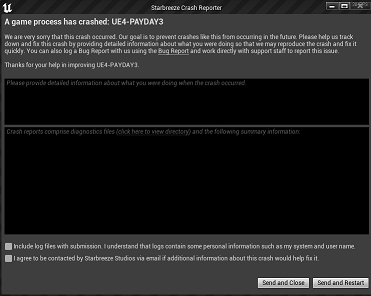
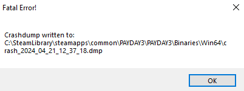

# This mod is experimental, problems are expected.

# How to Install
 - Place the contents of the `gamemod` folder in `{InstallDir}/PAYDAY3/Binaries/Win64`, make sure to overwrite UE4SS.dll
 - Extract the contents of `browserui`, it's location doesn't matter, as long as `serverbrowser.exe` and `icon.png` are in the same place

## Installing this mod triggers Windows Defender, is this a virus?
No, the software we use to package the server browser into one file
causes Windows Defender to mistakenly identify it as a virus.

This mod is fully open source, feel free to check the entire source of the mod if you wish.

If you do not trust the executable, you can execute `serverbrowser.py` yourself in MoolahNet's
GitHub repository.

# How to Use
 - After installing for the first time, run the `installdeps.bat` to install the dependencies the UI needs
 - To open the server browser, run `launchserverbrowser.bat`

# The game has crashed while using this mod, how can I report it?
The first step to reporting a game crash is to identify what type of crash it is,
for this mod there are two types, Unreal crashes and UE4SS crashes.

To report a crash, you will need to create an issue on https://github.com/MoolahModding/MoolahNet/issues
and submit it's crash dump.

**All bug reports must include the crash dump, or they will be closed**

Details on how to identify the crash and where to find it's crash dump can be found below.

## UE4 Crash
A UE4 crash looks like this:

It's crash dump can be found in the **most recently modified folder** in `%LOCALAPPDATA%\PAYDAY3\Saved\Crashes`, under the name `UE4Minidump.dmp`

## UE4SS Crash
A UE4SS crash looks like this:

It's crash dump can be found in the location specified in the dialog
